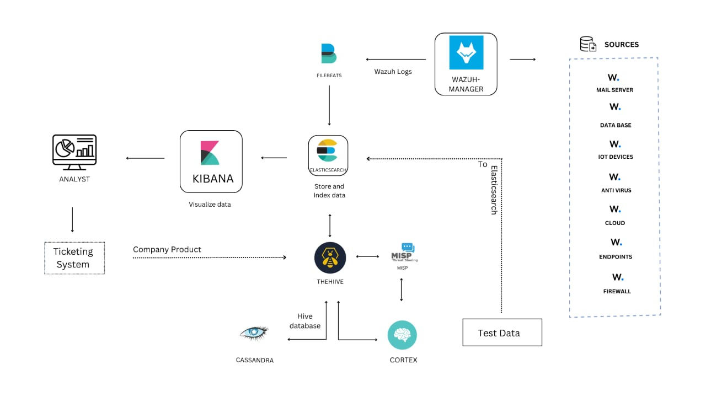

# 🛡️ Visualized Cyber Defense Center

**Building a robust SOC is crucial.** This project empowers you to explore and implement a modern SOC architecture using open-source tools. Dive into threat detection, analysis, and response!

## 👑 Project Overview

This project provides hands-on experience with a comprehensive SOC setup. We leverage powerful open-source components to create a solid foundation for security analysis and operations.

## 🎯 Goals and Benefits

Our mission is to:

*   ✅ **Centralize Security Monitoring:** Establish a unified platform using open-source technologies.
*   ✅ **Enhance Incident Response:** Improve detection and response through threat intelligence and automation.
*   ✅ **Streamline Threat Analysis:** Automate analysis to boost SOC efficiency.
*   ✅ **Visualize Security Data:** Provide insightful security analytics and visualizations for informed decision-making.
*   ✅ **Enable Real-Time Threat Hunting:** Facilitate proactive threat hunting with behavioral and signature-based detection.
*   ✅ **Standardize Incident Handling:** Implement structured incident handling with case management and response workflows.

## 🚀 Use Cases

This project addresses key security use cases:

*   **Centralized Data Collection:** Aggregate logs from diverse sources.
*   **Data Normalization & Parsing:** Structure data for consistent analysis.
*   **Security Analytics & Visualization:** Gain insights with Kibana (or similar).
*   **Incident & Case Management:** Automate case creation from alerts.
*   **Threat Hunting & Automation:** Proactively hunt and automate responses.
*   **Scalable Observable Analysis:** Analyze observables at scale.
*   **Active Threat Response & Collaboration:** Enable real-time team interaction.
*   **Threat Intelligence Integration:** Enrich data with open-source threat intelligence.

## 🧩 Components

### Phase 1

All components are open-source:

*   **TheHive:** Incident response platform. [GitHub](link-to-thehive-repo)
*   **Cortex:** Observable analysis tool. [GitHub](link-to-cortex-repo)
*   **MISP:** Threat intelligence platform. [GitHub](link-to-misp-repo)
*   **Wazuh:** Security monitoring solution. [GitHub](link-to-wazuh-repo)

### Phase 2 (optional)

*   **Filebeat:** Lightweight log shipper.
*   **Ticketing System:** Incident tracking and management.

## 🛠️ Installation

### Requirements

We recommend a VM-based environment, but you can adapt it to your infrastructure.

#### VM Specifications

| Component        | OS          | Size        | Purpose                                   |
|-----------------|-------------|-------------|-------------------------------------------|
| MISP            | Ubuntu 20   | t3.micro    | Threat Intelligence                      |
| Cortex          | Ubuntu 20   | t3a.medium  | Observable Analysis                       |
| TheHive         | Ubuntu 20   | t2.medium   | Incident Response                         |
| Wazuh           | Ubuntu 20   | t2.medium   | Security Monitoring                       |
| Filebeat        | Ubuntu 20   | t2.micro    | Log Shipping                             |
| Ticketing System | Ubuntu 20   | t2.micro    | Incident Tracking                         |

*(Installation guides for each component will be linked here)*  *(Consider adding more detailed installation steps or links to external guides)*

## ⚙️ Architecture (Work in Progress)

## 🚀 Roadmap & Future

### Planned Enhancements

*   ✅ Infrastructure as Code (Ansible/Terraform)
*   ✅ Advanced Threat Intelligence Integration
*   ✅ Enhanced Security Dashboards

## 🌏 Network Rules  *(Moved Down Here)*

| Port(s) | Protocol | Allowed IPs | Purpose                                       |
|---------|----------|-------------|-----------------------------------------------|
| 22      | TCP      | Your IP     | SSH Access                                     |
| 443     | TCP      | Your IP     | MISP UI                                      |
| 9001    | TCP      | Your IP     | Cortex UI                                     |
| 9000    | TCP      | Your IP     | TheHive UI                                    |
| 1514    | UDP      | Your IP     | Wazuh Agent Communication                   |
| 55000   | TCP      | Your IP     | Wazuh API                                     |
| All TCP |          | Cortex VM IP| Inbound API Access                             |
| All TCP |          | MISP VM IP  | Inbound API Access                             |
| All TCP |          | TheHive VM IP| Inbound API Access                             |

## 🙌 Contributing

Contributions are welcome! See our [Contributing Guidelines](link-to-contributing) for more information.  *(Make sure you have a CONTRIBUTING.md file)*

## 🤝 Support

Need help? contact me at [jassimusman66@gmail.com](mailto:jassimusman66@gmail.com). 

## 🔥 Let's Build a Secure Cyber Defense Together! 🔥
